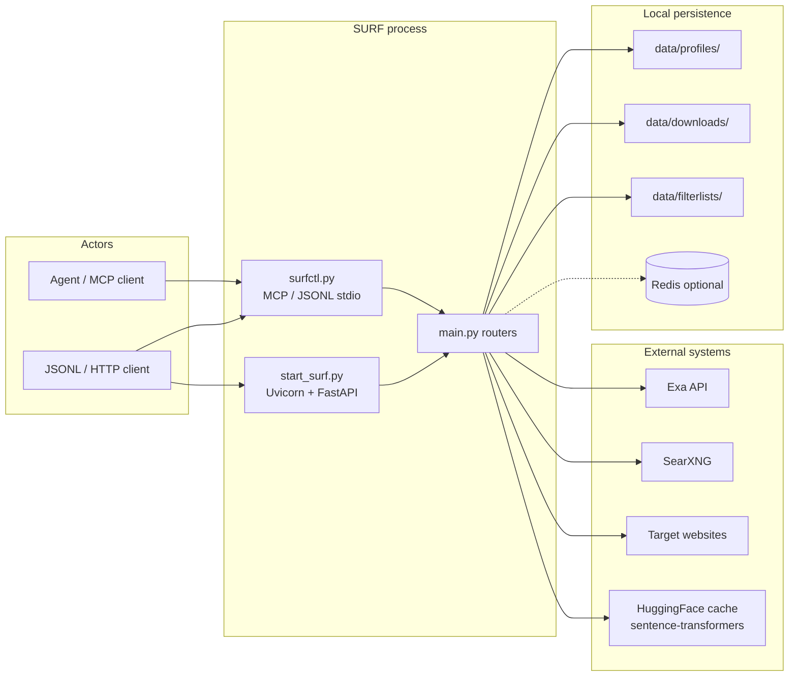
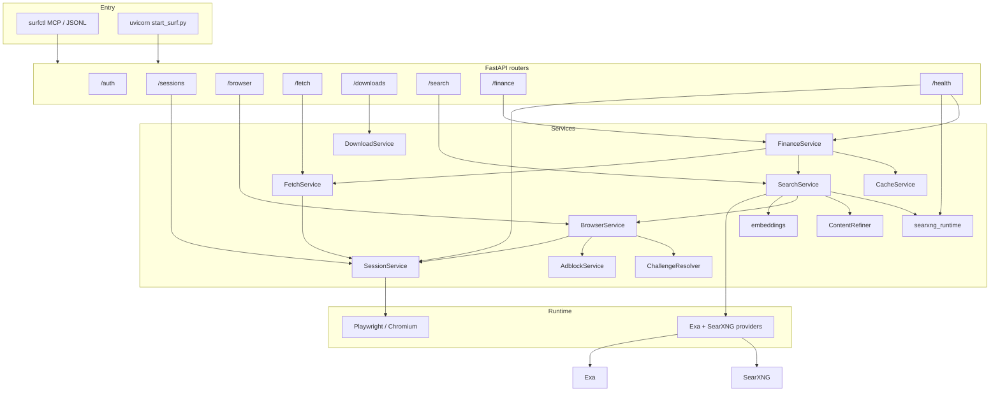
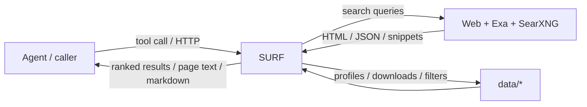
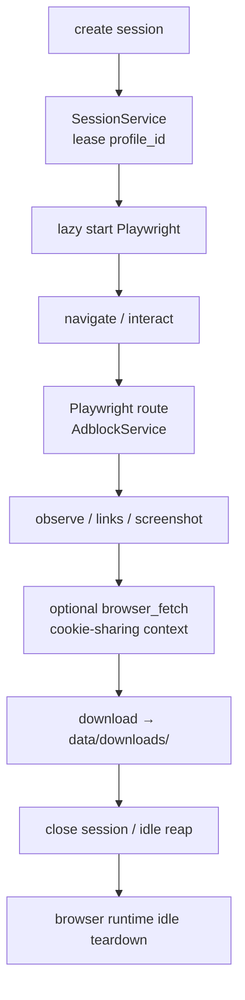
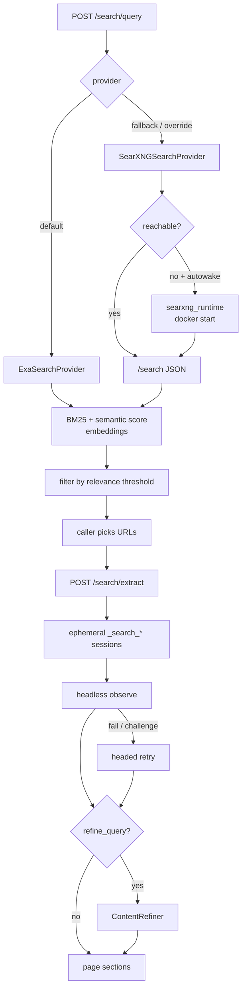
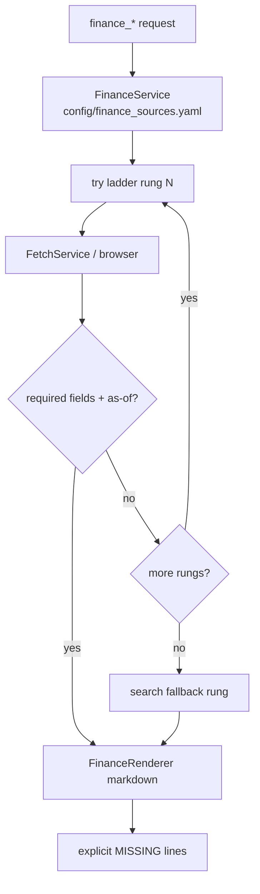
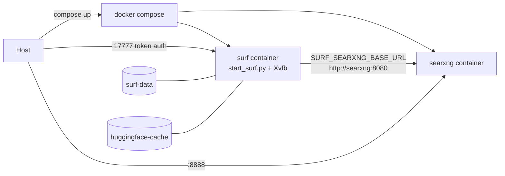

# SURF Architecture

SURF is a local FastAPI service around Playwright Chromium, Exa search (primary), and SearXNG (fallback). It is designed for agent-driven, occasional browsing, scraping, and web-research workflows.

## System Context

Agents prefer `surfctl.py mcp` (in-process FastAPI, no local port). `start_surf.py` is the optional HTTP development / Docker entrypoint.

## Component Architecture

## Data Flow Diagrams

### Level 0 — system boundary

### Browser session flow

### Search → extract flow

### Finance Pack flow

### Docker deployment flow

Compose forces `SURF_AUTH_MODE=token` (bind is `0.0.0.0`). Host-side MCP/stdio does **not** proxy into the container; the image serves HTTP only.

## Entrypoints

- `surfctl.py`: agent bridge for MCP stdio and raw JSONL stdio.
- `start_surf.py`: optional manual HTTP development server with port checks (Docker `CMD`).
- `main.py`: FastAPI application, middleware, lifespan cleanup, router mounting.

Mounted routers:

- `/auth`: local auth introspection and disabled compatibility endpoints.
- `/sessions`: browser session lifecycle and monitoring.
- `/browser`: navigation, observation, interaction, screenshots, network capture, downloads.
- `/fetch`: one-off HTTP/browser-context fetches.
- `/downloads`: sandboxed file listing/content/deletion.
- `/search`: Exa/SearXNG queries and parallel deep content extraction.
- `/finance`: Finance Pack typed endpoints (curated source ladders).
- `/health`: health, liveness, readiness, metrics, SearXNG probe, finance ladder probe.

## Services

- `SessionService`: lazy Playwright startup, browser context creation, persistent profile leases, per-session operation locks, idle/hard-TTL cleanup, browser-runtime idle teardown, blocker counters.
- `BrowserService`: page navigation, compact observations, interactions, screenshots, network capture, click downloads.
- `FetchService`: `httpx`, browser-context, `curl_cffi`, and optional `cloudscraper` fetches.
- `DownloadService`: sandboxed download persistence under `data/downloads`.
- `AdblockService`: ABP-style filter loading and request-block decisions.
- `SearchService`: Exa primary + SearXNG fallback with hybrid BM25 + semantic relevance scoring, configurable relevance threshold, and parallel deep extraction via ephemeral browser sessions with headless-to-headed retry, challenge resolution, and embedding-based section filtering (`ContentRefiner`). Embeddings are produced in-process by `sentence-transformers` (`services/embeddings`).
- `FinanceService`: curated source ladders from `config/finance_sources.yaml`; walks known-good endpoints before search fallback; returns structured markdown via `FinanceRenderer`; daily cache for macro/ERP endpoints.
- `searxng_runtime`: SearXNG health probe and optional Docker autostart.

## Runtime Storage

- `data/profiles/`: persistent Chromium profiles.
- `data/downloads/`: sandboxed downloads and index.
- `data/filterlists/`: cached EasyList/EasyPrivacy filters.

These paths are ignored by Git.

## Auth Model

Default `SURF_AUTH_MODE=loopback` allows requests only when SURF is bound to a loopback host. `SURF_AUTH_MODE=token` requires `SURF_API_TOKEN`.

SURF refuses loopback auth on non-loopback hosts. Demo login and runtime API-key creation are disabled.

MCP registers browser/finance tools only when `SURF_API_TOKEN` is set in the process environment; without it, free-tier tools (`search_*`, `browser_fetch`, `browser_health`) remain available.

## Session Model

Sessions are persistent by default and silent by default. A persistent `profile_id` can have only one active session at a time. Operations on a single session are serialized to avoid races on the Playwright page.

Idle cleanup closes inactive sessions after `SURF_IDLE_TIMEOUT_SECONDS`. Hard TTL closes sessions after `SURF_HARD_TTL_SECONDS`. Busy sessions are not reaped until the active operation completes.

The stdio bridge is process-scoped and thin. Health checks and non-browser work do not start Playwright. Browser runtime starts when a browser session is created, then stops after `SURF_BROWSER_IDLE_TIMEOUT_SECONDS` once no sessions are active. Default limits are `SURF_MAX_SESSIONS=3` and `SURF_MAX_HEADED_SESSIONS=1`.

## Blocking And Observation

Request blocking happens through Playwright routing on page traffic. `conservative` mode preserves document/XHR/fetch/websocket/eventsource traffic and same-site scripts/styles. `token_saver` also blocks images.

`/browser/observe` returns compact agent-facing state: visible text, token estimate, links, forms, actions, tables, warnings, cumulative blocker stats, and the most recent navigation blocker delta.

Observe modes:

- `compact`: default noise-pruned view.
- `reader`: article/main-content view.
- `data`: table/text-focused view.
- `full`: raw visible body text.

Browser-context `/fetch/request` reuses cookies but is not part of page adblock metrics.

## Search and Extraction

Stage 1 (`SearchService.search`): queries the configured provider (Exa by default, with optional SearXNG fallback), deduplicates results, scores with hybrid BM25 + semantic embeddings from the local `sentence-transformers` encoder, filters to results above `SURF_SEARCH_RELEVANCE_THRESHOLD`, and returns ranked snippets. If no result reaches the threshold, the top 3 are returned with `success: false`.

Stage 2 (`SearchService.deep_extract`): spins ephemeral `_search_*` browser sessions (not agent-managed), extracts page content in parallel (up to `SURF_MAX_SEARCH_SESSIONS`), retries failures in headed mode when relevance warrants it, and optionally refines output with `refine_query` embedding filters.

Search extraction reuses `BrowserService` observe modes and `ChallengeResolver` for Cloudflare-style blocks. Stats are exposed at `GET /search/stats`.

## Finance Pack

`FinanceService` walks ordered rungs in `config/finance_sources.yaml` per endpoint. Each rung is a known URL + selector map. Search fallback is the last rung. Output is fixed markdown with explicit `MISSING` fields. Ladder health is probed at `GET /health/finance`. Design notes live in `research/FINANCE_PACK.md`.

## Safety Boundary

SURF supports normal browser interaction, stable cookies, headed mode, conservative ad blocking, and browser-like one-off fetches. It does not automate CAPTCHA solving, credential bypass, access-control bypass, or high-volume crawling.
