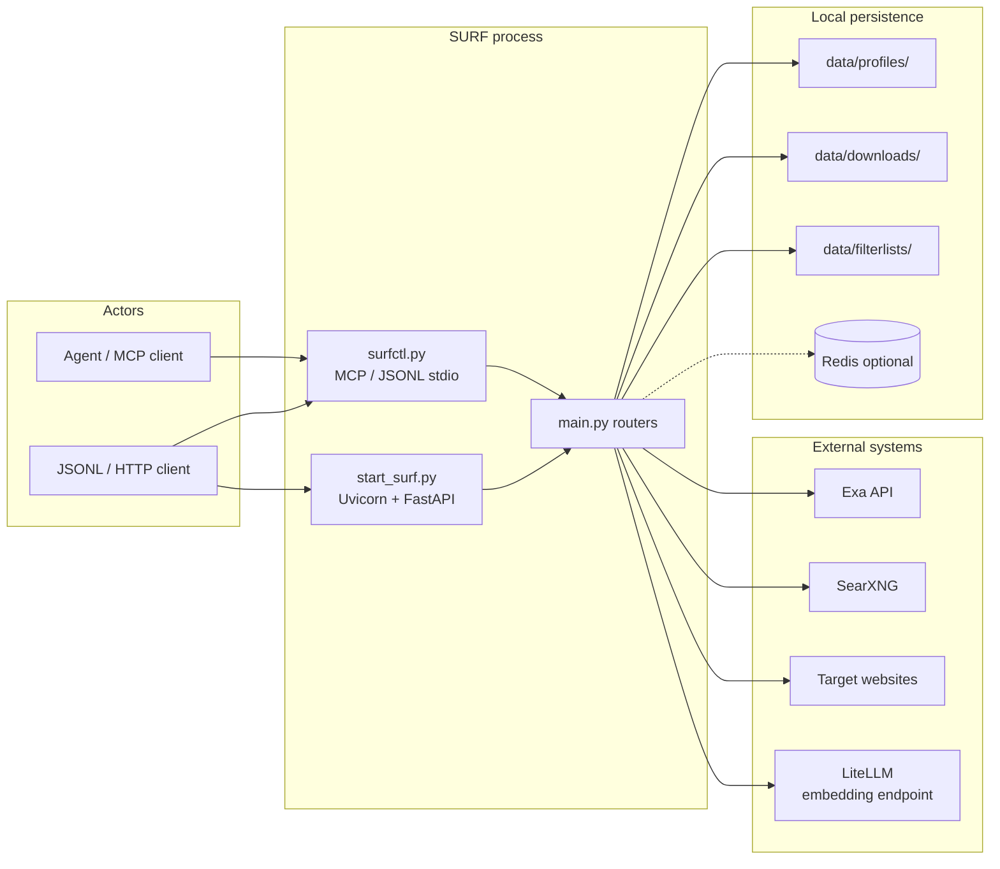
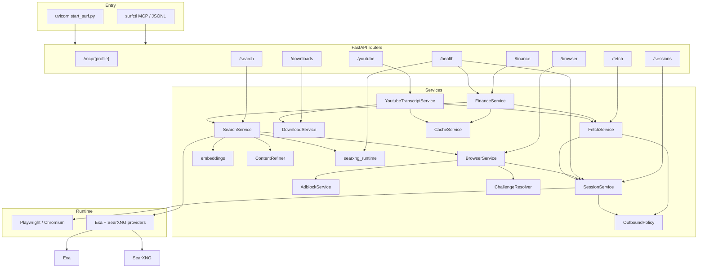
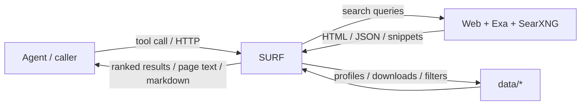
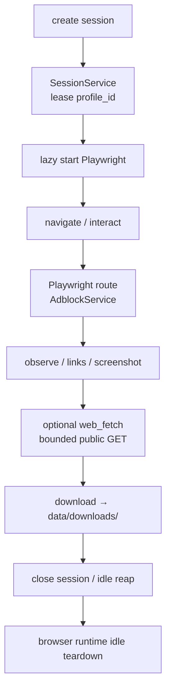
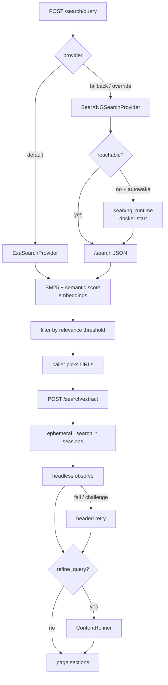
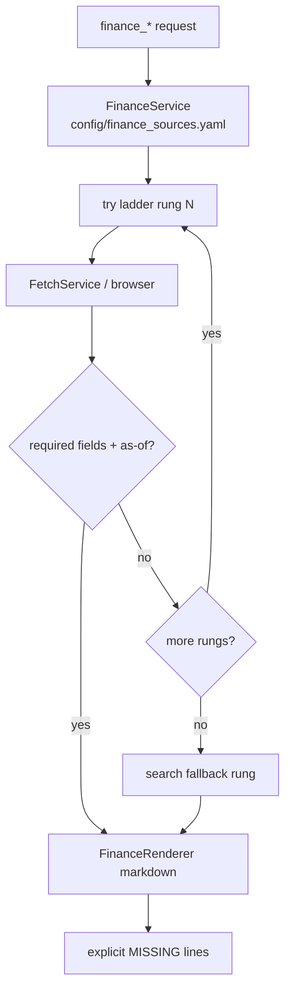
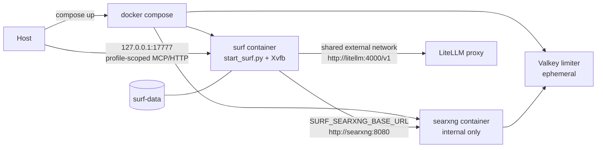

# SURF Architecture

SURF is a local FastAPI service around Playwright Chromium, Exa search (primary), and SearXNG (fallback). It is designed for agent-driven, occasional browsing, scraping, and web-research workflows.

## System Context

```mermaid
flowchart LR
  subgraph Actors
    Agent["Agent / MCP client"]
    Script["JSONL / HTTP client"]
  end

  subgraph SURF["SURF process"]
    Bridge["surfctl.py<br/>MCP / JSONL stdio"]
    HTTP["start_surf.py<br/>Uvicorn + FastAPI"]
    App["main.py routers"]
  end

  subgraph External["External systems"]
    Exa["Exa API"]
    SX["SearXNG"]
    Web["Target websites"]
    LiteLLM["LiteLLM<br/>embedding endpoint"]
  end

  subgraph Persist["Local persistence"]
    Profiles["data/profiles/"]
    Downloads["data/downloads/"]
    Filters["data/filterlists/"]
    Redis[("Redis optional")]
  end

  Agent --> Bridge
  Script --> Bridge
  Script --> HTTP
  Bridge --> App
  HTTP --> App
  App --> Exa
  App --> SX
  App --> Web
  App --> LiteLLM
  App --> Profiles
  App --> Downloads
  App --> Filters
  App -.-> Redis
```

Agents prefer `surfctl.py mcp` (in-process FastAPI, no local port). `start_surf.py` is the optional HTTP development / Docker entrypoint.

## Component Architecture

```mermaid
flowchart TB
  subgraph Entry
    MCP["surfctl MCP / JSONL"]
    UV["uvicorn start_surf.py"]
  end

  subgraph API["FastAPI routers"]
    MCPHTTP["/mcp/{profile}"]
    Sess["/sessions"]
    Br["/browser"]
    Fet["/fetch"]
    Dl["/downloads"]
    Srch["/search"]
    Fin["/finance"]
    YT["/youtube"]
    Hlth["/health"]
  end

  subgraph Services
    SS["SessionService"]
    BS["BrowserService"]
    FS["FetchService"]
    DS["DownloadService"]
    AB["AdblockService"]
    Search["SearchService"]
    Finance["FinanceService"]
    Transcript["YoutubeTranscriptService"]
    Emb["embeddings"]
    CR["ContentRefiner"]
    Ch["ChallengeResolver"]
    Egress["OutboundPolicy"]
    SXRT["searxng_runtime"]
    Cache["CacheService"]
  end

  subgraph Runtime
    PW["Playwright / Chromium"]
    Providers["Exa + SearXNG providers"]
  end

  MCP --> API
  UV --> API

  Sess --> SS
  Br --> BS
  Fet --> FS
  Dl --> DS
  Srch --> Search
  Fin --> Finance
  YT --> Transcript
  Hlth --> SS
  Hlth --> SXRT
  Hlth --> Finance

  BS --> SS
  BS --> AB
  BS --> Ch
  FS --> SS
  FS --> Egress
  SS --> Egress
  Search --> Providers
  Search --> Emb
  Search --> BS
  Search --> CR
  Search --> SXRT
  Finance --> FS
  Finance --> Search
  Finance --> Cache
  Transcript --> FS
  Transcript --> DS
  Transcript --> Cache
  SS --> PW
  Providers --> ExaAPI["Exa"]
  Providers --> SearX["SearXNG"]
```

## Data Flow Diagrams

### Level 0 — system boundary

```mermaid
flowchart LR
  U["Agent / caller"] -->|tool call / HTTP| SURF["SURF"]
  SURF -->|ranked results / page text / markdown| U
  SURF -->|search queries| NET["Web + Exa + SearXNG"]
  NET -->|HTML / JSON / snippets| SURF
  SURF -->|profiles / downloads / filters| DISK["data/*"]
  DISK --> SURF
```

### Browser session flow

```mermaid
flowchart TD
  A["create session"] --> B["SessionService<br/>lease profile_id"]
  B --> C["lazy start Playwright"]
  C --> D["navigate / interact"]
  D --> E["Playwright route<br/>AdblockService"]
  E --> F["observe / links / screenshot"]
  F --> G["optional web_fetch<br/>bounded public GET"]
  G --> H["download → data/downloads/"]
  H --> I["close session / idle reap"]
  I --> J["browser runtime idle teardown"]
```

### Search → extract flow

```mermaid
flowchart TD
  Q["POST /search/query"] --> P{"provider"}
  P -->|default| Exa["ExaSearchProvider"]
  P -->|fallback / override| SX["SearXNGSearchProvider"]
  SX --> Wake{"reachable?"}
  Wake -->|no + autowake| Docker["searxng_runtime<br/>docker start"]
  Wake -->|yes| SXOK["/search JSON"]
  Docker --> SXOK
  Exa --> Score["BM25 + semantic score<br/>embeddings"]
  SXOK --> Score
  Score --> Rank["filter by relevance threshold"]
  Rank --> URLs["caller picks URLs"]
  URLs --> X["POST /search/extract"]
  X --> Ephem["ephemeral _search_* sessions"]
  Ephem --> Headless["headless observe"]
  Headless -->|fail / challenge| Headed["headed retry"]
  Headless --> Refine{"refine_query?"}
  Headed --> Refine
  Refine -->|yes| CR["ContentRefiner"]
  Refine -->|no| Out["page sections"]
  CR --> Out
```

### Finance Pack flow

```mermaid
flowchart TD
  R["finance_* request"] --> L["FinanceService<br/>config/finance_sources.yaml"]
  L --> Rung["try ladder rung N"]
  Rung --> Fetch["FetchService / browser"]
  Fetch --> Valid{"required fields + as-of?"}
  Valid -->|yes| MD["FinanceRenderer markdown"]
  Valid -->|no| Next{"more rungs?"}
  Next -->|yes| Rung
  Next -->|no| SearchFB["search fallback rung"]
  SearchFB --> MD
  MD --> Miss["explicit MISSING lines"]
```

### Docker deployment flow

```mermaid
flowchart LR
  Host["Host"] -->|compose up| Compose["docker compose"]
  Compose --> SurfC["surf container<br/>start_surf.py + Xvfb"]
  Compose --> SXC["searxng container<br/>internal only"]
  Compose --> VK["Valkey limiter<br/>ephemeral"]
  SurfC -->|SURF_SEARXNG_BASE_URL<br/>http://searxng:8080| SXC
  SurfC -->|shared external network<br/>http://litellm:4000/v1| LiteLLM["LiteLLM proxy"]
  Host -->|127.0.0.1:17777<br/>profile-scoped MCP/HTTP| SurfC
  SXC --> VK
  Vol1[("surf-data")] --- SurfC
```

Compose explicitly enables keyless `web` and publishes Docker on host loopback only. Optional `browse`, `ui`, `finance`, and `ops` keys enable only their matching profiles. SearXNG is not host-published and uses Valkey-backed limiting. Containers run with a read-only root filesystem, reduced capabilities, no-new-privileges, health checks, and immutable image digests.

The MCP transport keeps DNS-rebinding protection enabled. Loopback hosts are always accepted; Compose explicitly adds only `surf:17777` through `SURF_MCP_ALLOWED_HOSTS` for AEGIS and HERMES traffic on the private network.

## Entrypoints

- `surfctl.py`: canonical tool registry plus profile-scoped MCP stdio bridge.
- `start_surf.py`: optional manual HTTP development server with port checks (Docker `CMD`).
- `main.py`: FastAPI application, middleware, lifespan cleanup, router mounting, and Streamable HTTP MCP endpoints.

Mounted routers:

- `/mcp/web`, `/mcp/browse`, `/mcp/ui`, `/mcp/finance`: profile-scoped Streamable HTTP MCP.
- `/sessions`: browser session lifecycle and monitoring.
- `/browser`: navigation, observation, interaction, screenshots, network capture, downloads.
- `/fetch`: one-off HTTP/browser-context fetches.
- `/downloads`: sandboxed file listing/content/deletion.
- `/search`: Exa/SearXNG queries and parallel deep content extraction.
- `/finance`: Finance Pack typed endpoints (curated source ladders).
- `/youtube`: one-video, caption-backed YouTube transcript extraction.
- `/health`: health, liveness, readiness, metrics, SearXNG probe, finance ladder probe.

## Services

- `SessionService`: lazy Playwright startup, browser context creation, persistent profile leases, per-session operation locks, idle/hard-TTL cleanup, browser-runtime idle teardown, blocker counters.
- `BrowserService`: page navigation, compact observations, interactions, screenshots, network capture, click downloads.
- `FetchService`: bounded streaming via `httpx`, browser-context, `curl_cffi`, and optional `cloudscraper`; redirects are manual and revalidated.
- `OutboundPolicy`: shared scheme, hostname, DNS, address-class, redirect, navigation, and browser-subresource validation.
- `DownloadService`: sandboxed download persistence under `data/downloads`.
- `AdblockService`: ABP-style filter loading and request-block decisions.
- `SearchService`: Exa primary + SearXNG fallback with hybrid BM25 + semantic relevance scoring, configurable relevance threshold, and parallel deep extraction via ephemeral browser sessions with headless-to-headed retry, challenge resolution, and embedding-based section filtering (`ContentRefiner`). Embeddings are requested in batches from the OpenAI-compatible LiteLLM endpoint (`services/embeddings`), with BM25/no-filter fallbacks when it is unavailable.
- `FinanceService`: curated source ladders from `config/finance_sources.yaml`; walks known-good endpoints before search fallback; returns structured markdown via `FinanceRenderer`; daily cache for macro/ERP endpoints.
- `YoutubeTranscriptService`: validates single-video YouTube URLs, uses yt-dlp for caption metadata, selects original manual/automatic tracks, fetches JSON3 through the outbound policy, normalizes timestamped segments, and saves complete Markdown through `DownloadService`.
- `searxng_runtime`: SearXNG health probe and optional Docker autostart.

## Runtime Storage

- `data/profiles/`: persistent Chromium profiles.
- `data/downloads/`: sandboxed downloads and index.
- `data/filterlists/`: cached EasyList/EasyPrivacy filters.
- `data/site_memory.db`: opt-in origin-level performance metadata only; disabled by default, ignored by Git, and never stores cookies/session data.

These paths are ignored by Git.

## Auth Model

Authorization is profile-scoped. `web` exposes four retrieval tools and is keyless only on loopback or when explicitly enabled for a private deployment. `browse` exposes 16 read-oriented browser tools, `ui` exposes all 22 browser tools, and `finance` exposes six financial-data tools. Their keys are independent and non-transitive. `ops` protects service operations but is not model-facing.

The REST route matrix enforces the same capabilities. `web_fetch` permits only a bounded public GET for a `web` principal. Missing specialist keys disable those profiles; invalid credentials never downgrade to keyless web. The legacy universal API token, admin token, auth mode, and runtime auth routes are unsupported.

SURF owns tool names, schemas, descriptions, profile inventories, and the four profile skills. Consumers such as AEGIS own only transport wrappers and mounting, and discover the live MCP contract rather than duplicating it.

## Session Model

Sessions are persistent by default and silent by default. A persistent `profile_id` can have only one active session at a time. Operations on a single session are serialized to avoid races on the Playwright page.

Idle cleanup closes inactive sessions after `SURF_IDLE_TIMEOUT_SECONDS`. Hard TTL closes sessions after `SURF_HARD_TTL_SECONDS`. Busy sessions are not reaped until the active operation completes.

The stdio bridge is process-scoped and thin. Health checks do not initialize session services or start Playwright, and CPU probes are non-blocking. Browser runtime starts when a browser session is created, then stops after `SURF_BROWSER_IDLE_TIMEOUT_SECONDS` once no sessions are active. Default limits are `SURF_MAX_SESSIONS=3` and `SURF_MAX_HEADED_SESSIONS=1`.

## Blocking And Observation

Request blocking happens through Playwright routing on page traffic. `conservative` mode preserves document/XHR/fetch/websocket/eventsource traffic and same-site scripts/styles. `token_saver` also blocks images.

`/browser/observe` returns compact agent-facing state: visible text, token estimate, links, forms, actions, tables, warnings, cumulative blocker stats, and the most recent navigation blocker delta.

Observe modes:

- `compact`: default noise-pruned view.
- `reader`: article/main-content view.
- `data`: table/text-focused view.
- `full`: raw visible body text.

Browser-context `/fetch/request` reuses cookies but is not part of page adblock metrics.

## Search and Extraction

Stage 1 (`SearchService.search`): queries the configured provider (Exa by default, with optional SearXNG fallback), deduplicates results, batch-encodes query/results once for hybrid BM25 + semantic scoring, filters to results above `SURF_SEARCH_RELEVANCE_THRESHOLD`, and returns ranked snippets. Provider-specific constraints that Exa cannot honor are rejected so SearXNG can handle them. If no result reaches the threshold, the top 3 are returned with `success: false`.

Stage 2 (`SearchService.deep_extract`): spins ephemeral `_search_*` browser sessions (not agent-managed), extracts page content in parallel (up to `SURF_MAX_SEARCH_SESSIONS`), retries failures concurrently under the headed-session semaphore when relevance warrants it, applies final Markdown budgets, and optionally refines output with batched `refine_query` embeddings. ETL callers use this public contract and publish artifacts atomically.

Search extraction reuses `BrowserService` observe modes and `ChallengeResolver` for Cloudflare-style blocks. Stats are exposed at `GET /search/stats`.

## Finance Pack

`FinanceService` walks ordered rungs in `config/finance_sources.yaml` per endpoint. Each rung is a known URL + selector map. Search fallback is the last rung. Output is fixed markdown with explicit `MISSING` fields. Ladder health is probed at `GET /health/finance`. Design notes live in `research/FINANCE_PACK.md`.

## Safety Boundary

SURF supports normal browser interaction, stable cookies, headed mode, conservative ad blocking, and browser-like one-off fetches. Central egress validation blocks local/private address classes by default, response/request bodies are bounded, cross-origin redirects shed sensitive headers, and browser cookies are selected per redirect target. It does not automate CAPTCHA solving, credential bypass, access-control bypass, or high-volume crawling.
